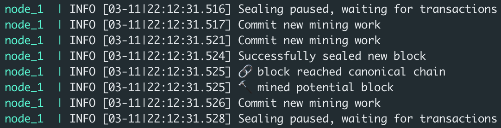
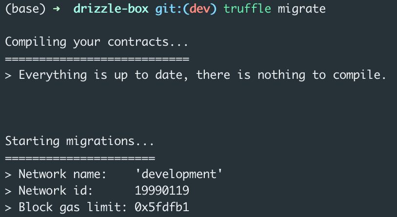
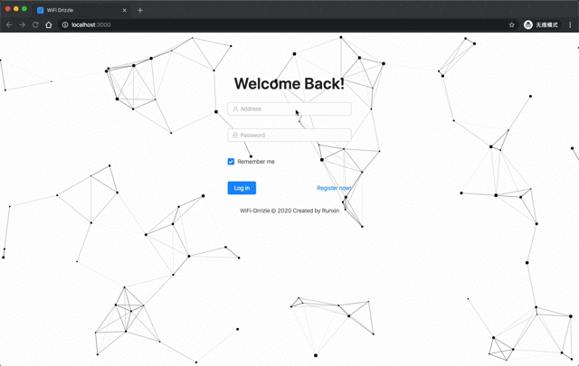
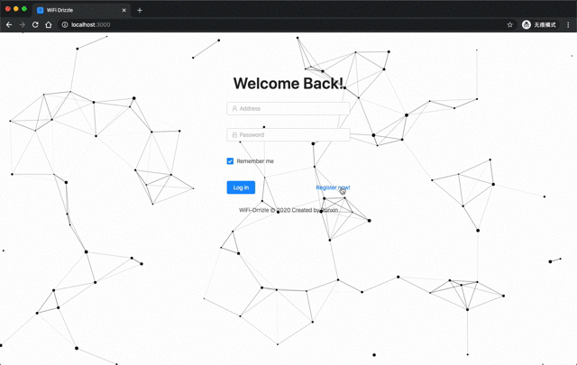
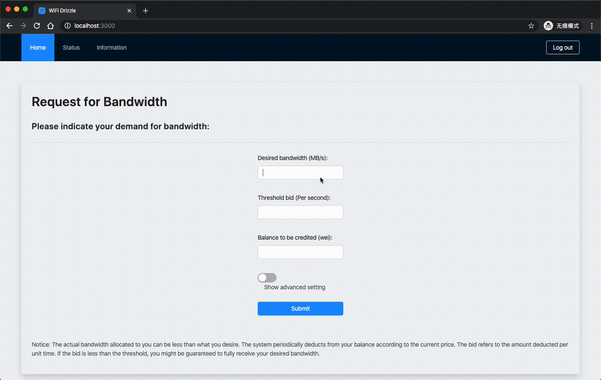
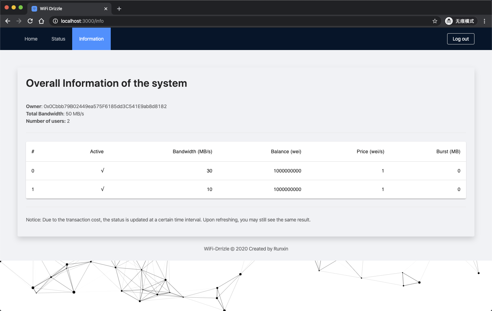
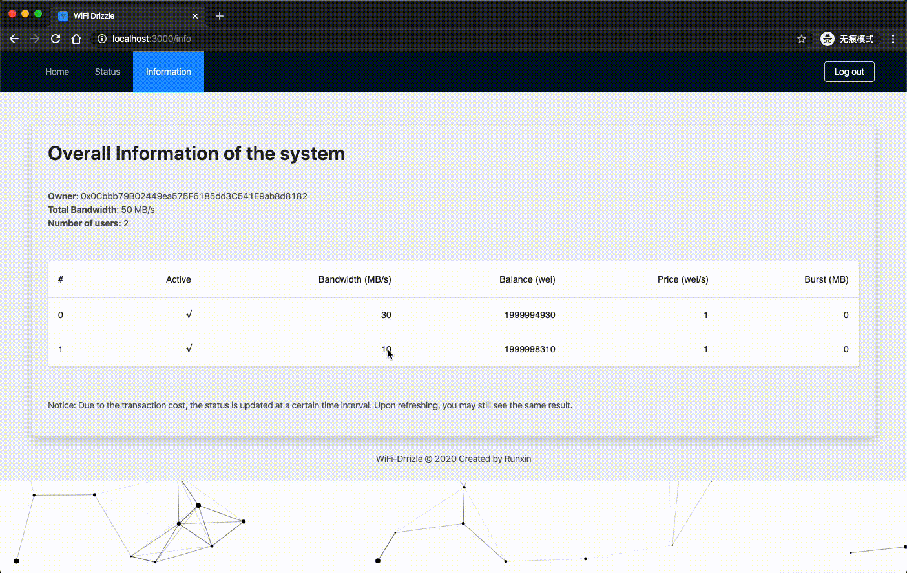
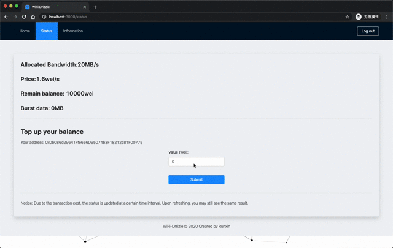
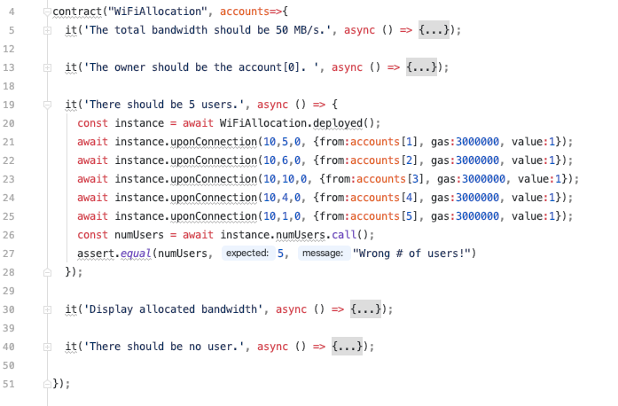
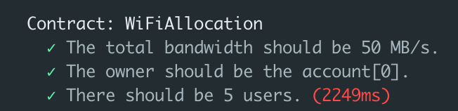

WiFi bandwidth differetiation service using smart contract

_Tian Runxin, 2020.3.12_

----

# Outline

1. [Tools](#3) : The development tools I used.

2. [Demo](#11) & [Features](#7)

3. Some progress: [Utils](#13) and [Test](#14) cases

3. [Problems](#16) 

4. [Plans](#18)

---

## Tools

1. Geth - Go Ethereum: Official Go implementation of the Ethereum protocol.
    `geth <other-options> --dev --dev.period 1 # PoA`

2. [Docker](#5)

3. [Truffle](#6) Suite
    - **Truffle**: the most popular development framework 
    - Ganache: One click blockchain testnet.
    - **Drizzle** (Font-end): Fast response. 

---

# Geth

## Clique PoA consensus



---

# Docker

- For deployment convenience, I builtup a docker container. With this tool, it can easily run the **PoA** blockchain network.

#### Why PoA (Clique PoA consensus)
- Allows blocks to be mined as-needed without excessive CPU and memory consumption.
- Producing blocks when there are transactions waiting to be "mined".

---

# Truffle Suite

1. Truffle: 
Contract compilition, deployment, and testing.

  

2. Drizzle: 
React-based font-end framework. 
  (Fast response but buggy)

---

# Features - Log in



- Use `web3.eth.personal.unlockAccount` to verify the user.
- Both `password` and `privatekey` are able to verify.

---

# Features - Register



---



---



---



---

# Features - Top up balance



---

# Some Utils

```
scripts
├── clear_allocation.js
├── clear_balances.js
├── get_balances.js
├── get_num_users.js
├── initial_balances.js
├── pre_allocation.js
└── target_allocation.js
```

---

### Test cases and result



---

### Test result



which means it takes around 450ms 
for every user entering the system

---

# Problems

1. Can not run docker or geth on raspberry pi.
    - tried solutions: 
      1. install a 64-bit OS (failed)
      2. reinstall OS (prepared)

2. Whether use a [new](http://dev.wifidog.org) wifi control framwork.

---

# WiFi Dog 
- An open source captive portal solution. 
(with DNS cache poisoning to redirect the user to authentication page )
    1. Location-aware delivery of internal or external content
    2. Authentication and authorization
    3. Centralizaed network monitoring


---

# Plans

1. solve the problems with raspberry pi

2. try the captive portal solution approach
