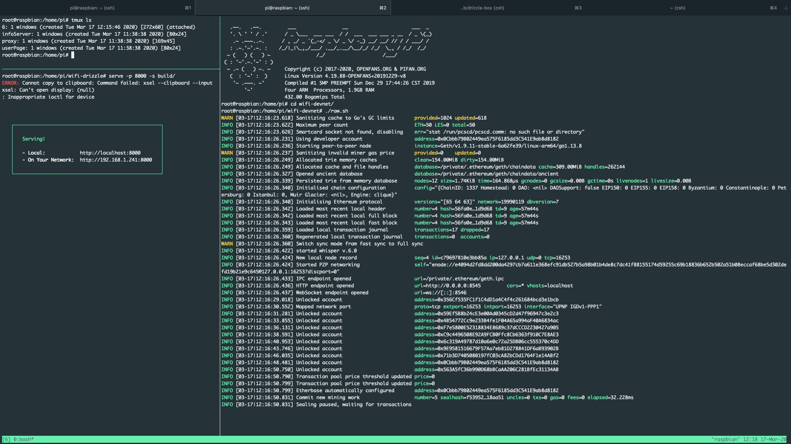
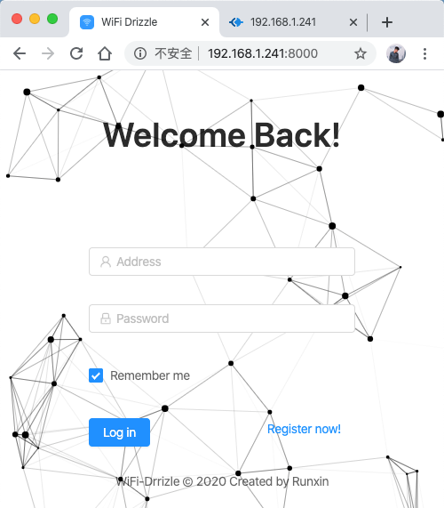
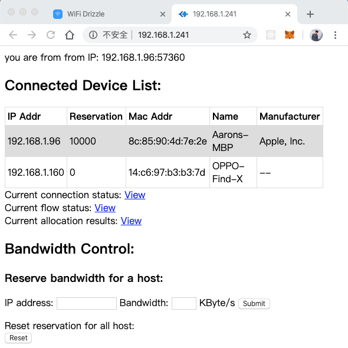

WiFi bandwidth differetiation service using smart contract

_Tian Runxin, 2020.3.17_

----

# Outline

1. **Problems**


2. **Plans**

---

# All in one raspberry pi

- PoA node: provide PoA network

- UI web server: serve the built website

- "WiFi Proxy": control the bandwidth

- ~~Owner~~: connection between blockchain and WiFi Proxy.

---



---





---

# Problems

1. Can not run docker or geth on raspberry pi.
    - tried solutions: 
      1. install a 64-bit OS (failed)
      2. reinstall OS (failed)
      3. compile a linux executable `geth` (success)

---

# Problems

2. Lack of `build-essential` while run owner.py
```
dpkg-dev fakeroot g++ g++-4.6 libalgorithm-diff-perl
  libalgorithm-diff-xs-perl libalgorithm-merge-perl
  libdpkg-perl libstdc++6-4.6-dev libtimedate-perl
```

```
src/common.h:34:10: fatal error: stdio.h: No such file or directory
  #include <stdio.h>
          ^~~~~~~~~
compilation terminated.
error: command 'aarch64-linux-gnu-gcc' failed with exit status 1
```
---

2. Lack of `build-essential`
```
root@raspbian:~/workspace/YourWiFi-v2# sudo apt-get install build-essential
Reading package lists... Done
Building dependency tree
Reading state information... Done
Some packages could not be installed. This may mean that you have
requested an impossible situation or if you are using the unstable
distribution that some required packages have not yet been created
or been moved out of Incoming.
The following information may help to resolve the situation:

The following packages have unmet dependencies:
 build-essential : Depends: libc6-dev but it is not going to be installed or
                            libc-dev
                   Depends: g++ (>= 4:8.3) but it is not going to be installed
E: Unable to correct problems, you have held broken packages.
```
---

2. Lack of `build-essential`
  possible solution: build executable

---

# Plans

1. ~~solve the problems with raspberry pi~~

2. try the captive portal solution approach

3. write the develop/deploy docs

4. add top-up API (e.g. Paylah, Wechat, Alipay...)

5. ...

6. write report and make final slides
